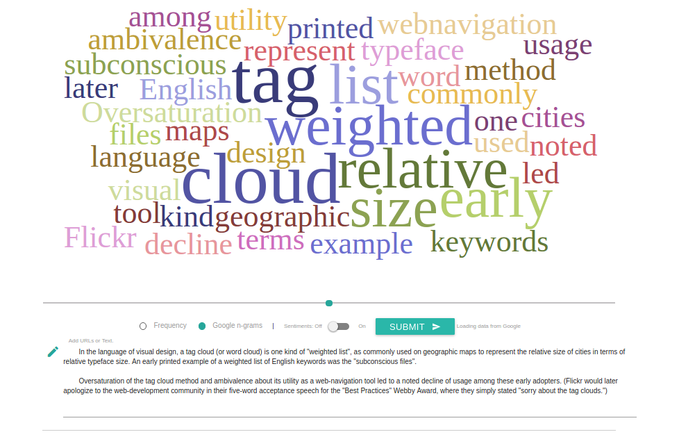

# TagCloud Sentimental Analysis
In this project, we create a Tagcloud visualization based on Google Books Ngram. The main idea is to modify word size based on chronological relevance [[1]](http://www.ycwu.org/Files/eurovis11_cloud.pdf), and to display word polarity (positive or negative sentiments) with colours. Furthermore, we use the following libraries and dataset:

* To obtain chronological data, we use Google Books Ngram [[2]](http://storage.googleapis.com/books/ngrams/books/datasetsv2.html), which allows us to download data through a simple API.  
* To obtain the TagCloud visualization, we made a web application in HTML5 and Javascript. Mainly, we use D3.js [[3]](http://d3js.org/) in combination with a word cloud library [[4]](https://github.com/jasondavies/d3-cloud), which is based on D3’s Force layout [[5]](https://github.com/mbostock/d3/wiki/Force-Layout).
* To color the words based on their positivity and negativity, we use a Python library for Sentiment Analysis [[6]](http://www.clips.ua.ac.be/pages/pattern) that makes use of WordNet [[6]](http://wordnet.princeton.edu/) (a large lexical database of English). The sentiment function returns word polarity value, which is between -1, very negative, and 1, very positive.
* To generate the data for the visualization, we use a simple PHP server. Through the PHP exec() function, we invoke the Python scripts, and then we preprocess the data. Finally, the server comunicates to the client, sending a JSON file with the data ready to be visualized.

## Requirement 
* Python 2.* or more
* Pandas Py Lib
* Pattern Py Lib 
* PHP Sever

## Result

